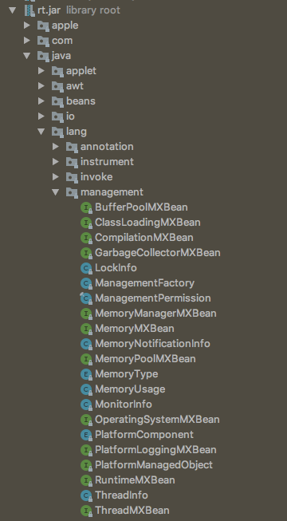
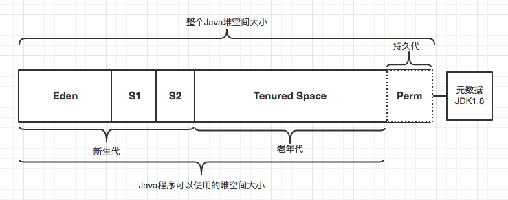
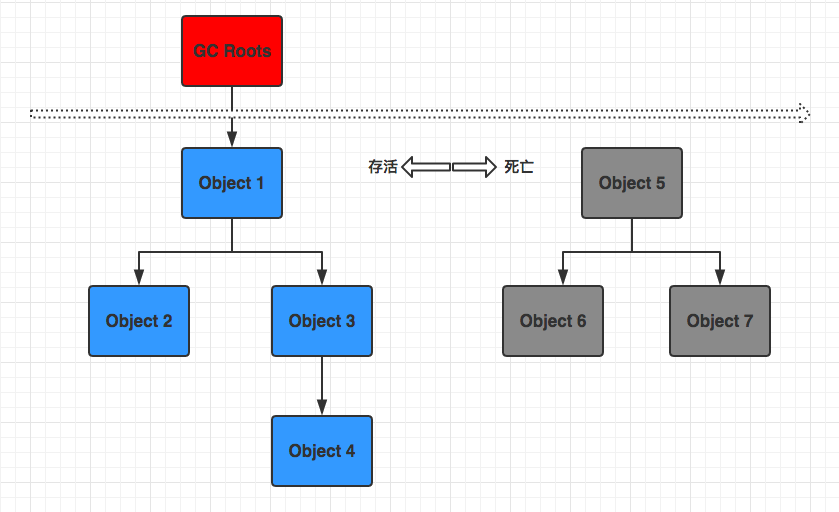
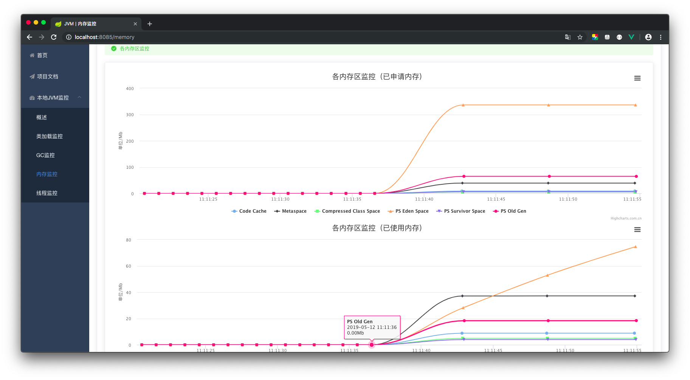
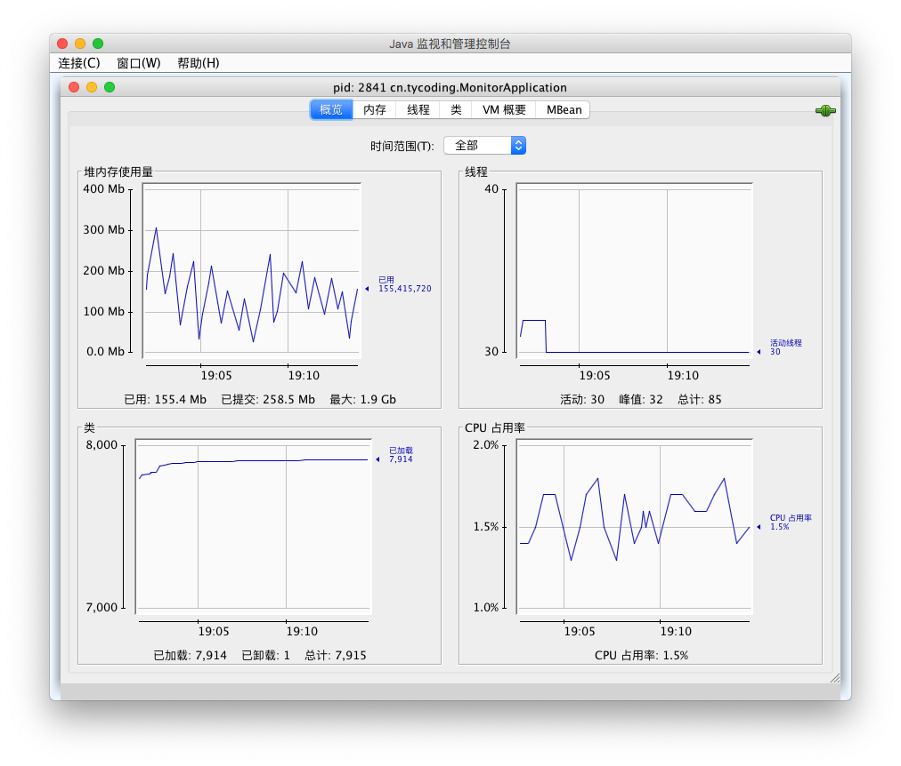

# Java应用性能监控系统

使用JMX（Java Management Extensions）简易实现，提供对类加载监控、内存监控、线程监控。获取Java应用本地JVM内存、GC、线程、Class、堆栈、系统数据等。

参考了Java内置的同样使用JMX（Java Management Extensions）实现的监控工具 **jconsole**，通过JMX系统的MXBean接口，快速获取Java应用JVM数据。

线上地址：[http://39.105.46.235:8085/](http://39.105.46.235:8085/)

# 文档

## JMX

JDK内置了一些监控JVM的API接口，就是`java.lang.management`包，其中提供了很多MXBean的接口类用来监控JVM的数据。并且JDK也内置了很多工具用于监控Java应用，其中`jconsole`就是使用JMX实现的，

| 名称 | 解释 |
| --- | --- |
| `ClassLoadingMXBean` | 获取类装载信息，已装载、已卸载量 |
| `CompilationMXBean` | 获取编译器信息 |
| `GarbageCollectionMXBean` | 获取GC信息，但他仅仅提供了GC的次数和GC花费总时间 |
| `MemoryManagerMXBean` | 提供了内存管理和内存池的名字信息 |
| `MemoryMXBean` | 提供整个虚拟机中内存的使用情况 |
| `MemoryPoolMXBean` | 提供获取各个内存池的使用信息 |
| `OperatingSystemMXBean` | 提供操作系统的简单信息 |
| `RuntimeMXBean` | 提供运行时当前JVM的详细信息 |
| `ThreadMXBean` | 提供对线程使用的状态信息 | 

## 垃圾回收算法

### 标记-清除算法

如果两个对象间发生引用，那么就将未关联任何引用的对象标记，最后统一回收。**缺点**：会造成大量不连续的内存碎片。

###  复制算法

将整个堆内存分为**等大小的两块空间**，每次仅适用其中的一块。当发生垃圾回收时，将A区中仍存活的对象复制到B区，然后清空A区。**缺点**：虽然避免了**标记-清除**算法那样产生大量不连续的内存碎片，但要将整块内存分为两部分代价太大。

### 标记-整理算法

和**标记-清除**算法类似，都对为关联任何引用的对象标记，但在清除时不直接回收对象，而是将所有存活的对象移动到一端（端点处），最后直接清除端边界以外的内存。**特点**：解决了**标记-清除**算法产生大量不连续碎片问题，同时解决**复制算法**对内存分为两块代价太高的问题。

### 分代收集算法

将整块堆内存分为：新生代、老年代、元数据区（JDK1.7前叫持久区）；其中新生代细分为Eden、Survivor0、Survivor1三块区域。

进入堆内存的对象首先分配在新生代（主要是Eden、Survivor0区，默认Eden:Survivor=8:1），当新生代发生垃圾回收时（Minor GC）：GC首先回收新生代，将Eden、Survivor0区中仍存活的对象复制到Survivor1区，如果Survivor1区内存不够就将对象直接存放到老年代；如果老年代内存满了就触发Major GC（Full GC，即新生代、老年代都回收）。

元数据区（JDK1.7前叫持久代）主要存放静态文件、Java类、方法等，也称为方法区。持久代和元数据区区别：持久代使用的JVM的堆内存区域；而元数据区直接使用的本地的物理内存。

## HotSpot算法实现

### 可达性分析算法

可达性分析算法主要思想：将内存中的所有对象都分别用一个个节点表示，如果对象之间存在引用那么这两个节点就相互关联；并且存在一个起始节点（GC Roots），如果一个对象顺着应用链不能到达GC Roots时（即不可达），这个对象就被判定为死亡，应该被GC回收。

可作为GC Roots的对象：

1. 虚拟机栈（栈帧的本地变量表）中引用的对象。
2. 方法区中类静态属性引用的对象
3. 方法区中常量引用的对象
4. 本地方法栈中Native方法引用的对象

### HotSpot

**问题引入**

HotSpot使用了可达性分析算法判定对象的存活，但依次从GC Root引用链向下寻找对象未免太耗时。

**解决办法**

HotSpot通过一组**OopMap**对象记录每个节点引用位置，通过**OopMap**对象可以准确的知道GC Roots引用链上的引用关系，以此快速判断对象的存活。

**问题引入**

HotSpot通过指令生成**OopMap**对象记录对象引用位置，但大量的对象必然需要大量的**OopMap**对象，也会占用大量的内存空间。

**解决办法**

HotSpot并不大量生成OopMap对象，而只在特殊位置（称为安全点 Safepoint）生成OopMap对象记录引用链上对象的引用关系，此时GC的发生场所就受到限制，只有在安全点（Safepoint）处才中断线程进行GC。

## 垃圾收集器

### 串行收集器

**特点**

1. 它仅仅使用单线程进行垃圾回收
2. 它是独占式的垃圾回收
3. 进行垃圾回收时，Java应用程序占用的线程都要暂停等待GC回收（Stop-The-World）

**举例**

`Serial` -- 单线程（串行）收集器，新生代、老年代收使用串行回收。新生代采用**复制算法**，老年代采用**标记-整理算法**

其中众多收集器中只有`Serial`收集器是单线程（串行）收集器。

### 并行收集器

**特点**

1. 多线程（并行）回收
2. 垃圾回收时，同样会暂停应用线程，但不是Stop-The-World；因为使用多线程在多核CPU上，应用线程可能与垃圾回收线程同时进行。

**举例**

1. `ParNew` -- **新生代**多线程（并行）收集器；只作用与新生代。启用该收集器（`-XX:+UseParNewGC`），新生代采用**复制算法**，老年代默认使用`Serial`(串行)收集器（即使用**标记-整理**算法）

2. `Parallel Scavenge` -- **新生代**多线程（并行）收集器；只作用于新生代。同样启用该收集器（`-XX:+UseParallelGC`），新生代采用**复制算法**，老年代采用**标记-整理**算法。与`ParNew`收集器不同的是更关注系统吞吐量，支持GC自适应调节策略

3. `Parallel Old` -- **老年代**多线程（并行）收集器；只作用于老年代，采用**标记-整理**算法。它是`Parallel Scavenge`收集器的老年代版本，通常配置`-XX:+UseParallelOldGC`新生代使用ParallelGC收集器、老年代使用ParallelOld收集器

### CMS收集器

CMS（Concurrent Mark Sweep）收集器是一种以获取最短路径为目的的回收器，并行收集，基于**标记-清除**算法实现。

主要通过在不同的阶段标记对应引用关系，当发生GC时，虚拟机能以最快的方式判断对象是否存活。

### G1收集器

JDK1.7新增，取代CMS

**特点**

1. 分代垃圾回收
2. 分区算法，不要求新生代、老年代空间都连续
3. 并行、并发，支持GC线程和用户线程同时进行以提高效率
4. 空间整理：回收过程中会进行对象适当位置调整，减少空间碎片
5. 可预见性：可选取部分区域进行回收，缩小回收范围，减少全局停顿

## 截图

Java内置监控工具：`jconsole`（终端输入命令即可打开）

## 联系

QQ交流群：671017003   欢迎各位前辈或萌新入驻

- [Blog@TyCoding's blog](http://www.tycoding.cn)
- [GitHub@TyCoding](https://github.com/TyCoding)
- [ZhiHu@TyCoding](https://www.zhihu.com/people/tomo-83-82/activities)